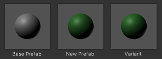
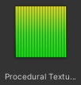

# Asset Script

This package provides a way to create importer script inside asset itself.

# Installing Package

Put this repository in the Packages directory.

# Usage

[Assets > Create > Asset Script] to create new script asset.

# Getting Started

This script creates new prefab.

**cube.assetscript**

```cs
#using UnityEngine
AddObjectToAsset("GameObject", GameObject.CreatePrimitive(PrimitiveType.Cube));
```

# Examples

## Prefab Example 1

This example is about changing an existing prefab.



*New Prefab* is created from *Base prefab* which is standard prefab. Within import process, Material and Colliders are changed.

*Variant* is prefab variant based on *New Prefab*.

```cs
#using UnityEngine
var go = CopyAsset<GameObject>("Base Prefab.prefab");
if (go)
{
	// change collider type
	Destroy(go.GetComponent<Collider>());
	go.AddComponent<BoxCollider>();

	// set material
	go.GetComponent<MeshRenderer>().sharedMaterial = LoadAsset<Material>("../Source Material.mat");

	AddObjectToAsset("GameObject", go);
}
```

## Prefab Example 2

This example demonstrates reusable scripts.

### File Structure
- include.txt
- Sphere.prefab
- Cube.prefab
- Sphere.assetscript
- Cube.assetscript

Unlike previous example, source prefab is automatically chosen from name of asset script. Also all scripts shares same code via include directive.

**include.txt**
```cs
#using UnityEngine

var go = CopyAsset<GameObject>(GetAssetPathWithoutExtension() + ".prefab");

if (go)
{
	go.GetComponent<Renderer>().sharedMaterial = LoadAsset<Material>("../Source Material.mat");
	AddObjectToAsset("Prefab", go);
}
```

**Sphere.assetscript, Cube.assetscript**
```
#include "include.txt"
```

## Procedural Texture Example



```cs
#using UnityEngine
var tex = new Texture2D(64, 64);
var pixels = tex.GetPixels();

for (var i = 0; i < pixels.Length; ++i)
{
	pixels[i] = new Color((float)i / pixels.Length, i % 2, (i + 1) % 2);
}

tex.SetPixels(pixels);
AddObjectToAsset("Texture", tex);
```
